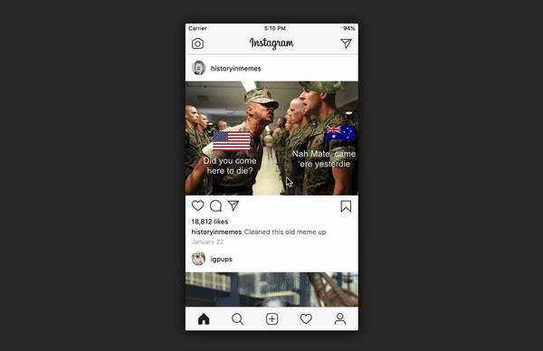

# Instagram private post sharing redesign

### [Live Demo](https://dbabbs.github.io/instagram-dm-redesign)

## Motivation

When direct messaging posts from a private account on Instagram, the app does not tell you which friends are following the account.

As such, you do not know if you will be sending a private post to your friend, which he or she won't be able to see.

This prototype considers a simple redesign of the Instagram direct messaging modal to include a simple text notifying you which of your friends are following the account.

To begin, please press the send/envelope icon below the post.

## About

This is a live prototype of the sample Instagram interaction completely written in HTML, CSS, and vanilla JavaScript.